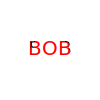

# SVG-Logo-Maker

  ## Description  ✏️
  
 A command line logo maker that creates a logo in SVG format.
  
  ## Table of Contents 📖
  
  [Installation](#installation)

  [Usage](#usage)

  [License](#license)

  [Built-With](#Built-With)

  [Tests](#tests) 

  [Credits](#credits)

  [Questions](#questions)
  
  ## Installation 

To install the necessary dependencies, run the following command:

''
node index.js
''

Ensure you have Node.js, npm, Inquirer, and Jest installed.

  
  ## Usage 

  After installing the necessary dependencies, type `node index.js` in the terminal and follow the prompts to create your logo. You can enter up to 3 characters, choose the text color, shape, and shape color for your logo. Once you have completed the prompts, the logo will be saved as `logo.svg`, and the console will confirm your success.

### Screenshots

### Screenrecording

[SVG Logo Maker](https://drive.google.com/file/d/11QQXqhr4SE-BdTty-5RK66I0b4BhRoYS/view?usp=sharing)

______________________________________________________________________________

## License

   
  This project is licensed under the MIT license.
  
## Built-With

- JavaScript
- Node.js

## Tests 

To run tests, run 

"node index.js"

in the terminal.
  

## Credits 

https://github.com/Jarvisismy-copilot

 ## Questions 
  
  If you have any questions, contact me directly at [here](mailto:Chelseajarvis3301@icloud.com)
  or visit my [GitHub](https://github.com/Jarvisismy-copilot)

